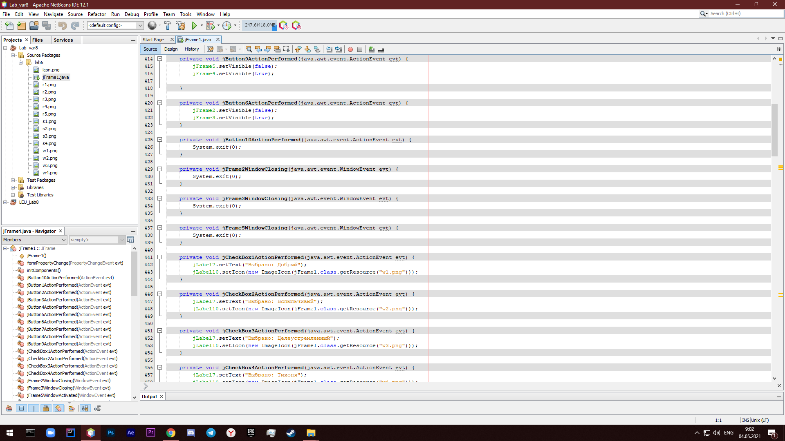
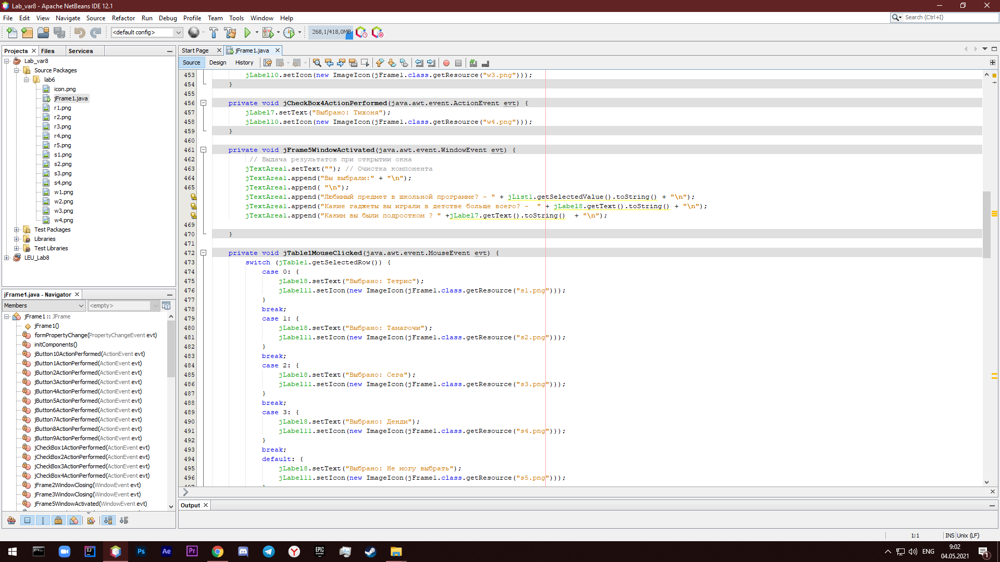
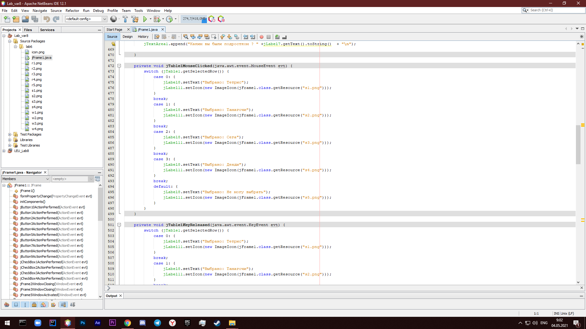
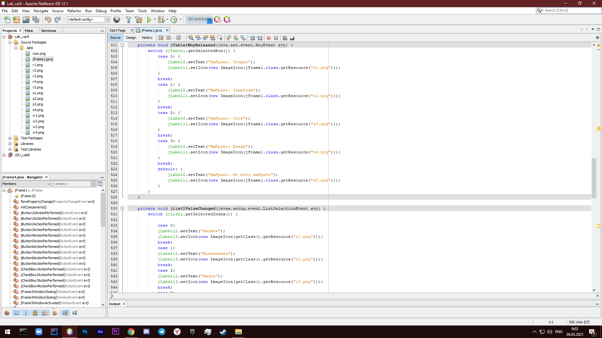
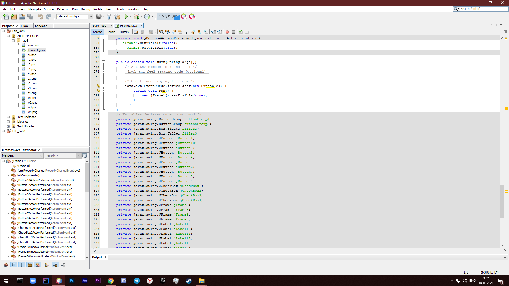
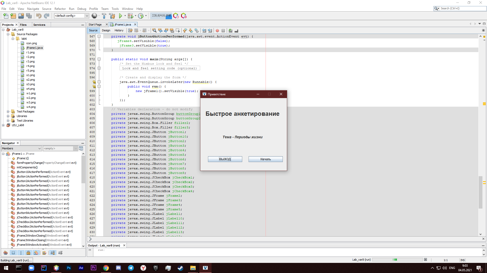
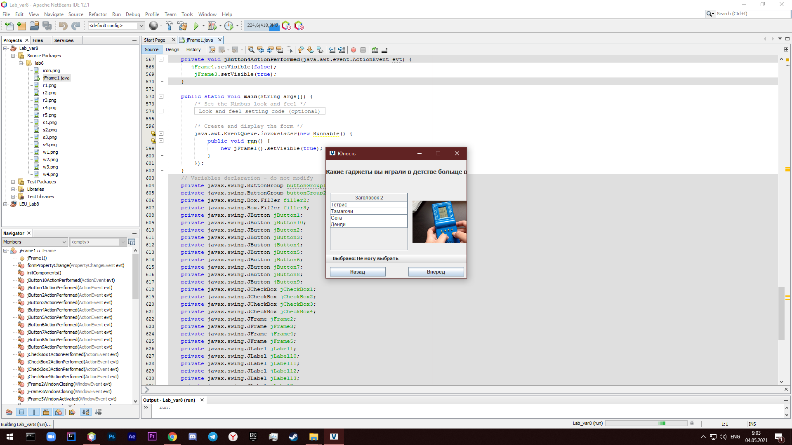
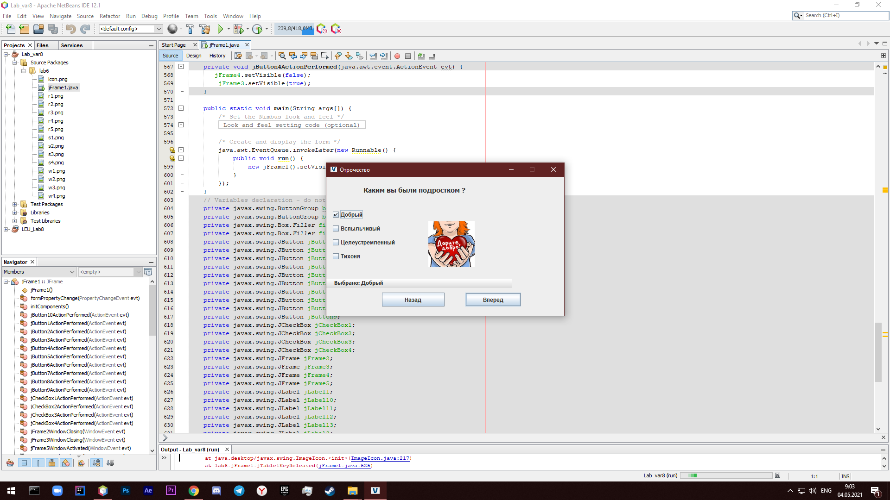
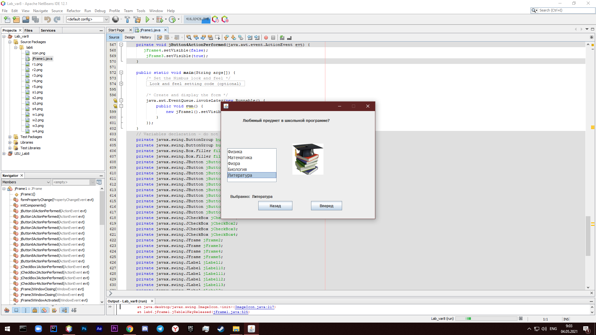

# Tema6

# Ногайбай Даулеткерей

| Фамилия, имя студента | Группа | Дисциплина| Тема |
| ------ | ------ | ------ | ------ |
| Ногайбай Даулеткерей | ИС-302 | СВП | Тема 6 - Многооконные программы |

Скриншоты кода в NetBeans:

Вывод:

